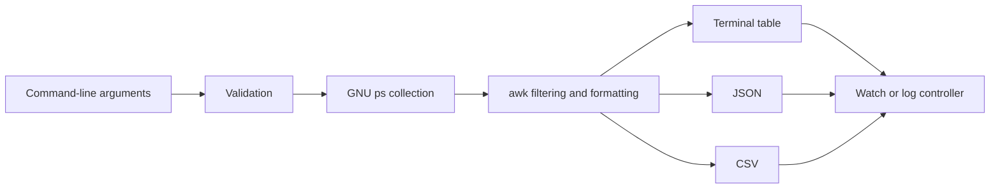

# memtop

[](https://github.com/dydgital9/memtop/actions/workflows/ci.yml)
[](LICENSE)
[](memtop)
[](#requirements)

`memtop` is a lightweight Linux command-line process memory inspector written
in Bash and `awk`. It lists processes by resident memory or memory percentage,
supports focused filtering, and can produce terminal, JSON, CSV, watch, and log
output.

The project is designed as a practical alternative to repeatedly assembling
long `ps`, `sort`, and `awk` pipelines during troubleshooting.

## Contents

- [Why memtop](#why-memtop)
- [Features](#features)
- [Example output](#example-output)
- [Requirements](#requirements)
- [Installation](#installation)
- [Bash completion](#bash-completion)
- [Quick start](#quick-start)
- [Option reference](#option-reference)
- [Practical examples](#practical-examples)
- [Machine-readable output](#machine-readable-output)
- [How it works](#how-it-works)
- [Memory interpretation](#memory-interpretation)
- [Development](#development)
- [Repository structure](#repository-structure)
- [Roadmap](#roadmap)
- [Contributing](#contributing)
- [Security](#security)
- [License](#license)

## Why memtop

Linux already provides mature process tools such as `ps`, `top`, and `htop`.
`memtop` does not attempt to replace them. It provides a repeatable command
interface for a narrower workflow:

- Find the highest resident-memory processes quickly.
- Switch between RSS and `%MEM` sorting.
- Inspect one user, one PID, or processes above a memory threshold.
- Export the same process view as JSON or CSV.
- Refresh the display or append snapshots to a log.
- Use one dependency-light Bash script on common Linux systems.

## Features

- Defaults to the top 20 processes ordered by RSS.
- Sorts by resident memory or process memory percentage.
- Supports automatic or fixed KiB, MiB, and GiB display units.
- Filters by effective user, PID, and minimum RSS threshold.
- Shows command names or full command lines.
- Adds PPID data and light tree indentation.
- Produces colored tables, plain text, JSON, or CSV.
- Supports repeated watch mode and append-only snapshot logging.
- Accepts both `--option value` and `--option=value` forms for value options.
- Validates numeric arguments, sort fields, units, PIDs, and intervals.

## Example output

A normal terminal snapshot resembles the following structure. Values depend on
the machine and active workload.

```text
    PID   %MEM        RSS USER         COMMAND
   4821    8.7     712.4M user           firefox
   1964    4.2     342.8M user           cinnamon
   2310    2.6     211.5M user           Xorg
   5177    1.4     114.9M user           alacritty
```

Use `--no-color` when redirecting table output to a file or pager.

## Requirements

Runtime requirements:

- Linux
- Bash
- GNU `ps`, normally supplied by `procps`
- POSIX-compatible `awk`, such as `mawk` or `gawk`
- GNU Coreutils commands used by the script
- `clear` and `sleep` for watch mode

Optional development tools:

- `shellcheck`
- Python 3 for JSON validation and smoke tests
- `jq` for interactive JSON inspection
- `make` for the included install and validation targets

Install common dependencies on Linux Mint or Ubuntu:

```bash
sudo apt update
sudo apt install --yes \
    bash \
    coreutils \
    make \
    mawk \
    ncurses-bin \
    procps \
    python3 \
    shellcheck
```

## Installation

### Clone the repository

```bash
git clone https://github.com/dydgital9/memtop.git
cd memtop
```

### Install for the current user

The included Makefile installs the executable under `~/.local/bin` and the
manual page under `~/.local/share/man/man1` by default.

```bash
make install
```

Verify the result:

```bash
command -v memtop
memtop --help
man memtop
```

The default user-local installation places files at:

```text
~/.local/bin/memtop
~/.local/share/man/man1/memtop.1
~/.local/share/bash-completion/completions/memtop
```

Ensure the user-local binary directory is in `PATH`:

```bash
case ":$PATH:" in
    *":$HOME/.local/bin:"*) ;;
    *) export PATH="$HOME/.local/bin:$PATH" ;;
esac
```

To make that change persistent in Bash:

```bash
printf '%s\n' \
    'export PATH="$HOME/.local/bin:$PATH"' \
    >> "$HOME/.bashrc"
```

### Install manually

```bash
install -Dm755 memtop \
    "$HOME/.local/bin/memtop"

install -Dm644 memtop.1 \
    "$HOME/.local/share/man/man1/memtop.1"
```

Refresh the user manual database when `mandb` is available:

```bash
if command -v mandb >/dev/null 2>&1; then
    mandb "$HOME/.local/share/man"
fi
```

### Install system-wide

```bash
sudo make PREFIX=/usr/local install
```

This installs:

```text
/usr/local/bin/memtop
/usr/local/share/man/man1/memtop.1
```

### Uninstall

Current-user installation:

```bash
make uninstall
```

System-wide installation:

```bash
sudo make PREFIX=/usr/local uninstall
```


## Bash completion

The Makefile installs the included Bash completion definition when using the
default installation target.

Start a new shell after installation, or load it immediately with:

```bash
source "$HOME/.local/share/bash-completion/completions/memtop"
```

Examples of completion-aware arguments include:

```bash
memtop --sort <TAB>
memtop --unit <TAB>
memtop --user <TAB>
memtop --pid <TAB>
```

If completion does not load automatically, make sure the `bash-completion`
package is installed and initialized by the shell.

## Quick start

Show the default top 20 processes by RSS:

```bash
memtop
```

Show ten processes:

```bash
memtop --num 10
```

Show full command lines:

```bash
memtop --full --num 10
```

Refresh every two seconds:

```bash
memtop --watch 2 --hide-self
```

Show JSON and validate it:

```bash
memtop --json --num 5 |
    python3 -m json.tool
```

## Option reference

### Selection and sorting

| Option | Meaning |
|---|---|
| `-n N`, `--num N`, `--num=N` | Show at most `N` rows |
| `-s FIELD`, `--sort FIELD` | Sort by `rss` or `pmem` |
| `-u UNIT`, `--unit UNIT` | Display RSS as `auto`, `kb`, `mb`, or `gb` |
| `--user USER` | Show processes owned by `USER` |
| `--pid PID` | Show one process ID |
| `--limit-rss SIZE` | Require a minimum RSS value |
| `--reverse` | Reverse the selected sort order |

### Presentation

| Option | Meaning |
|---|---|
| `-f`, `--full` | Show the full command line |
| `--no-header` | Hide the table or CSV header |
| `--plain` | Disable color and hide the header |
| `--self`, `--hide-self` | Hide `memtop`, `ps`, and `awk` helper rows |
| `--tree` | Include PPID and light tree indentation |
| `--width N` | Trim command text to `N` characters |
| `--summary` | Add totals to table or CSV output |
| `--no-color` | Disable ANSI color |
| `--color` | Force ANSI color |
| `-V`, `--version` | Show version information and exit |

The `--self` name is retained as a compatibility alias. Its current behavior is
to hide the `memtop`, `ps`, and `awk` helper processes.

### Output and collection

| Option | Meaning |
|---|---|
| `--json` | Produce JSON |
| `--csv` | Produce CSV |
| `--log FILE` | Append snapshots to `FILE` |
| `-w SEC`, `--watch SEC` | Refresh every `SEC` seconds |
| `--once` | Run once even when watch mode is supplied |
| `-h`, `--help` | Show help |

### RSS size syntax

`--limit-rss` accepts an integer or decimal number followed by an optional
single-letter unit:

| Input | Interpretation |
|---|---|
| `250000` | 250000 KiB |
| `250000K` | 250000 KiB |
| `500M` | 500 MiB |
| `1.5G` | 1.5 GiB |

## Practical examples

Show the ten largest resident-memory users:

```bash
memtop --num 10 --sort rss
```

Sort by memory percentage instead of RSS:

```bash
memtop --sort pmem --num 15
```

Inspect processes for the current user:

```bash
memtop --user "$USER" --full
```

Inspect one process and its complete command line:

```bash
memtop --pid 1928 --full --tree
```

Show processes using at least 500 MiB of RSS:

```bash
memtop --limit-rss 500M --summary
```

Create a plain snapshot for a support ticket:

```bash
memtop --no-color --summary --num 30 \
    > memtop-snapshot.txt
```

Save CSV for spreadsheet or Python analysis:

```bash
memtop --csv --num 100 \
    > memtop-snapshot.csv
```

Append a snapshot every five seconds:

```bash
memtop --watch 5 \
    --hide-self \
    --log "$HOME/memtop.log"
```

Force one collection while retaining a reusable watch command:

```bash
memtop --watch 2 --once --json --num 10
```

## Machine-readable output

### JSON

```bash
memtop --json --num 3
```

The JSON document contains collection metadata, process objects, and aggregate
values. The structure is similar to:

```json
{
  "generated_at": "2026-08-06 15:30:00",
  "sort": "rss",
  "unit": "auto",
  "processes": [
    {
      "pid": 4821,
      "ppid": 1730,
      "pmem": 8.7,
      "rss_kb": 729498,
      "rss": "712.4M",
      "user": "user",
      "command": "firefox"
    }
  ],
  "count": 1,
  "total_rss_kb": 729498,
  "total_rss": "712.4M",
  "total_pmem": 8.7
}
```

Validate JSON with Python:

```bash
memtop --json --num 10 |
    python3 -m json.tool >/dev/null
```

Validate and query JSON with `jq`:

```bash
memtop --json --num 10 |
    jq '.processes[] | {pid, rss, command}'
```

### CSV

```bash
memtop --csv --num 10
```

The CSV header is:

```text
pid,ppid,pmem,rss_kb,rss,user,command
```

Use `--no-header` when appending multiple data-only snapshots to one file.
Use `--summary` only when the additional summary row is acceptable to the CSV
consumer.

## How it works



The implementation follows a compact pipeline:

1. Bash parses options and validates values.
2. GNU `ps` collects PID, PPID, `%MEM`, RSS, user, and command data.
3. `awk` stores process records, applies filters, and formats output.
4. Bash controls one-shot execution, watch mode, screen clearing, and logging.

### Engineering decisions

- `set -o pipefail` exposes failures inside the collection pipeline.
- Option validation rejects unsupported sort fields and units early.
- CSV fields are quoted and embedded double quotes are escaped.
- JSON strings escape backslashes, quotes, and common control characters.
- Human-readable and machine-readable output share the same process selection.
- The implementation stays dependency-light and transparent for inspection.

## Memory interpretation

`memtop` reports values obtained from `ps`:

- **RSS** is resident set size, or the physical memory pages currently mapped
  into a process address space.
- **%MEM** is the process RSS as a percentage of physical memory according to
  `ps`.

RSS values from multiple processes are not a direct measurement of unique total
memory consumption. Shared libraries and shared memory may appear in more than
one process RSS value. Use tools such as `smem`, `/proc/PID/smaps_rollup`, or a
profiler when proportional or mapping-level analysis is required.

## Development

### Run all included checks

```bash
make check
```

### Check Bash syntax

```bash
bash -n memtop
```

### Run ShellCheck

```bash
make lint
```

### Run smoke tests directly

```bash
bash tests/smoke.sh
```

### Inspect a development copy without installing

```bash
bash ./memtop --help
bash ./memtop --json --num 3 |
    python3 -m json.tool
```

### Test the manual page

```bash
make man
```

Use the clean pager test when custom `MANPAGER`, `PAGER`, or `LESS` settings are
suspected:

```bash
make man-clean
```

### Diagnose manual-page display problems

The repository stores `memtop.1` as ordinary uncompressed roff source. The
Makefile also installs it uncompressed. This avoids requiring the project to
manage gzip compression itself.

During installation, the Makefile removes only a stale
`memtop.1.gz` from the selected installation directory before writing the
uncompressed page. This prevents two user-local copies of the same manual page
from competing for resolution.

Inspect the file:

```bash
file memtop.1
head -n 5 memtop.1
```

Render it directly through `groff`:

```bash
groff -mandoc -Tutf8 memtop.1 |
    less -R
```

Bypass custom pager environment variables while testing `man`:

```bash
env \
    -u MANPAGER \
    -u PAGER \
    -u LESS \
    -u LESSOPEN \
    -u LESSCLOSE \
    man -l ./memtop.1
```

The repository also includes:

```bash
bash scripts/diagnose-man.sh
```

This reports the active pager variables, the installed manual path, file type,
and several rendering checks.


## Repository structure

```text
memtop/
├── .github/
│   ├── ISSUE_TEMPLATE/
│   │   └── bug_report.yml
│   ├── workflows/
│   │   └── ci.yml
│   └── pull_request_template.md
├── completions/
│   └── memtop.bash
├── docs/
│   └── REPOSITORY_SETUP.md
├── scripts/
│   └── diagnose-man.sh
├── tests/
│   └── smoke.sh
├── CHANGELOG.md
├── CONTRIBUTING.md
├── LICENSE
├── Makefile
├── README.md
├── SECURITY.md
├── memtop
└── memtop.1
```

## Roadmap

Planned improvements:

- Add Bats tests for argument validation and output edge cases.
- Improve watch behavior for redirected JSON and CSV streams.
- Add release archives and SHA-256 checksums.
- Add installation packages only after the command interface stabilizes.
- Evaluate proportional set size support as a separate optional mode.

Roadmap items are proposals rather than promises. Issues and pull requests
should define behavior before implementation.

## Contributing

Bug reports and focused improvements are welcome. Read
[CONTRIBUTING.md](CONTRIBUTING.md) before opening a pull request.

A useful contribution should include:

- The Linux distribution and Bash version.
- The exact command that reproduced the behavior.
- Expected and actual output.
- A focused patch with a smoke test when practical.

## Security

`memtop` reads process metadata exposed by the local operating system and does
not require elevated privileges for normal use. Full command lines may contain
sensitive arguments. Review output before posting logs publicly.

Report security concerns using the process in [SECURITY.md](SECURITY.md).

## License

This project is licensed under the MIT License. See [LICENSE](LICENSE).

## Author

Maintained by [dydgital9](https://github.com/dydgital9).
